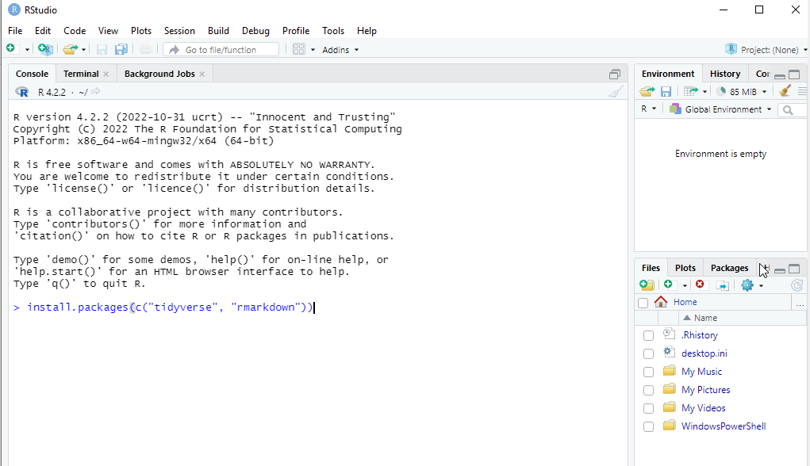

## Introducción a R, Data Mining & Business Intelligence

En este curso vamos a aprender a programar en R, un lenguaje de programación con gran foco en la estadística.

Como IDE vamos a utilizar Rstudio y vamos a generar los notebooks en quarto, algo parecido a Jupyter Notebook.

### Instalación

#### 1. Instalación R

Primero teneis que instalarlos R, el lenguaje. Es gratuito, opensource y se distribuye bajo licencia GPLv2. Su página principal es esta: [https://www.r-project.org/](https://www.r-project.org/)

En función de vuestro sistema operativo tendréis que instalar una versión diferente. A continuación teneis los enlaces a los instaladores que os teneis que descargar para vuestro sistema operativo:

*   Windows: [R-4.2.2-win.exe](https://cran.r-project.org/bin/windows/base/R-4.2.2-win.exe)
*   Mac-OS: https://cran.r-project.org/bin/macosx/
    - Si vuestro Mac tiene un chip de Apple M1 o superior instalad esta versión: [R-4.2.2-arm64.pkg](https://cran.r-project.org/bin/macosx/big-sur-arm64/base/R-4.2.2-arm64.pkg)
    - Si vuestro Mac tiene un chip de Intel-64 instalad esta versión: [R-4.2.2.pkg](https://cran.r-project.org/bin/macosx/base/R-4.2.2.pkg)
*   Linux: Lo mejor es que instaleis el paquete r-base de vuestra distribución. Por ejemplo:
    - Ubuntu: https://cran.r-project.org/bin/linux/ubuntu/
    - Fedora: https://cran.r-project.org/bin/linux/fedora/

#### 2. Instalación Rstudio

Una vez que tengais instalado R podeis instalar Rstudio, su IDE. Existen diferentes versiones de Rstudio, varias de ellas de pago. Nosotros nos descargaremos la versión gratuita que se distribuye bajo licencia AGPL v3.

Podeis instalarlo desde su página principal [https://posit.co/download/rstudio-desktop/](https://posit.co/download/rstudio-desktop/) o seleccionar vuestro enlace en función de vuestro sistema operativo:

* Windows: [RStudio-2022.07.2-576.exe](https://download1.rstudio.org/desktop/windows/RStudio-2022.07.2-576.exe)
* Mac-OS: [RStudio-2022.07.2-576.dmg](https://download1.rstudio.org/desktop/macos/RStudio-2022.07.2-576.dmg)
* Linux: Elegid vuestra distro


#### 3. Comprobación de que todo está bien

Abrid Rstudio y en la pestaña de *Consola* escribid lo siguiente y pulsad ENTER:
```
install.packages(c("tidyverse","rmarkdown","nasapower", "zoo", "caret"))
```



Esto instalará diferentes librerías que necesitareis a lo largo del curso.
Si estais en Mac-OS os preguntará si quereis instalar los paquetes desde los binarios o si los quereis compilar. Elegid la instalación desde binarios.

El proceso de instalación de estas librerías puede llevar varios minutos.


Podeis comprobar que se ha instalado correctamente si al ejecutar:
```
library("tidyverse")
```

os sale algo como esto:
```
── Attaching packages ─────────────────────────────────────── tidyverse 1.3.2 ──
✔ ggplot2 3.4.0      ✔ purrr   0.3.5 
✔ tibble  3.1.8      ✔ dplyr   1.0.10
✔ tidyr   1.2.1      ✔ stringr 1.5.0 
✔ readr   2.1.3      ✔ forcats 0.5.2 
── Conflicts ────────────────────────────────────────── tidyverse_conflicts() ──
✖ dplyr::filter() masks stats::filter()
✖ dplyr::lag()    masks stats::lag()
```

Si habeis completado todos estos pasos ya teneis todo listo para comenzar el curso.


### Clonad el repositorio

Para el curso utilizaremos notebooks de tipo [Quarto](https://quarto.org/). No teneis que instarlar nada adicional ya que Rstudio incorpora las librerías necesarias.
Es parecido a los notebooks de Jupyter y son en cierta medida equivalentes. La principal diferencia es que el notebook de Quarto se guarda en formato texto.

Para clonar el repositorio ejecutad:
```
git clone https://github.com/KeepCoding-BC-Glovo-Mujeres-en-tech/data-mining
```


